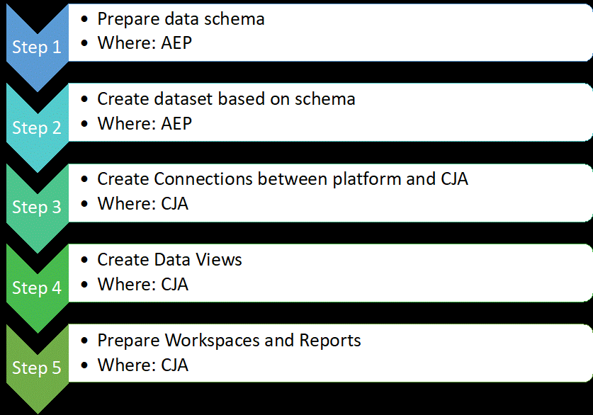
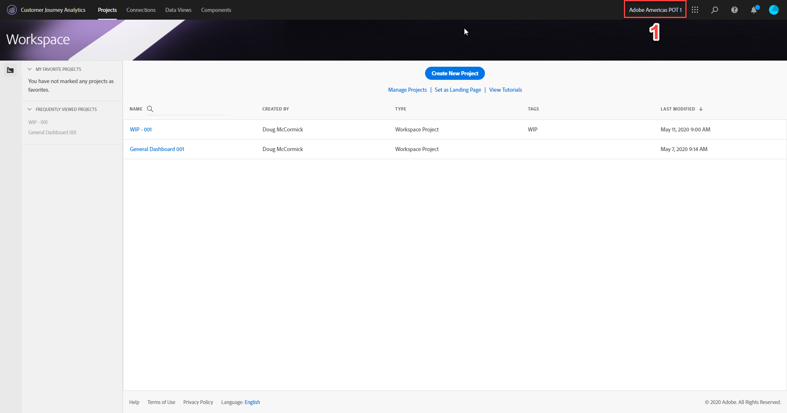
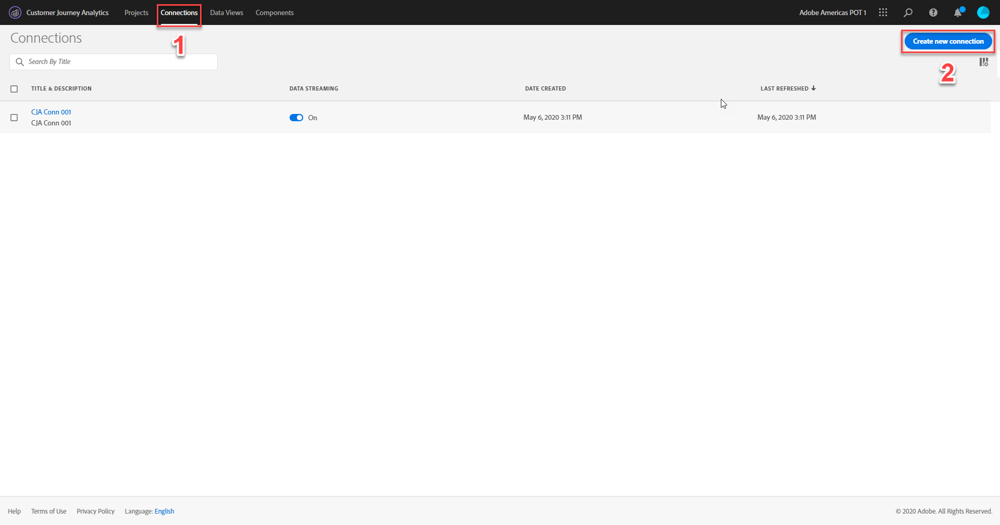
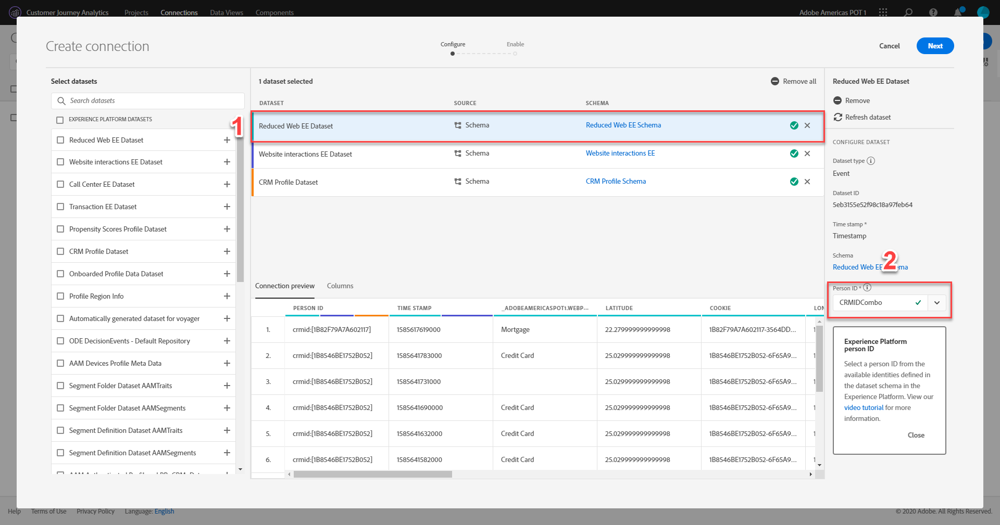
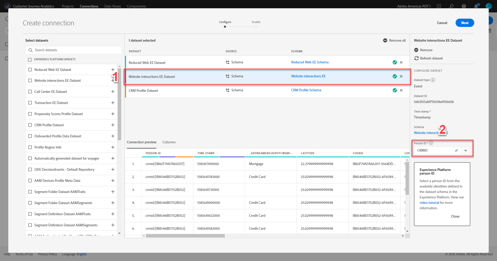
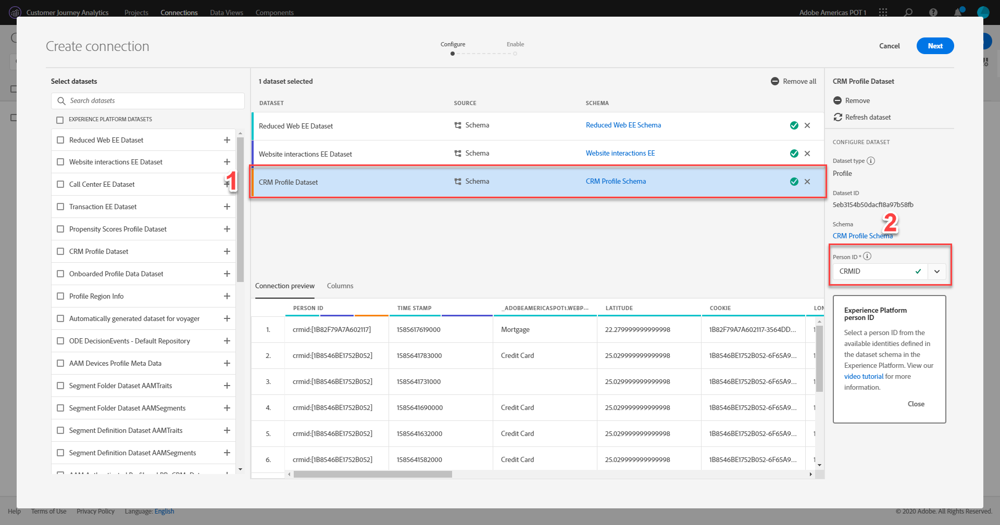
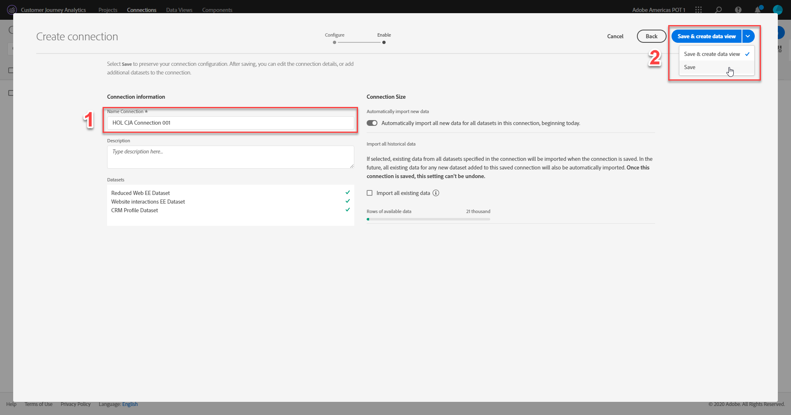
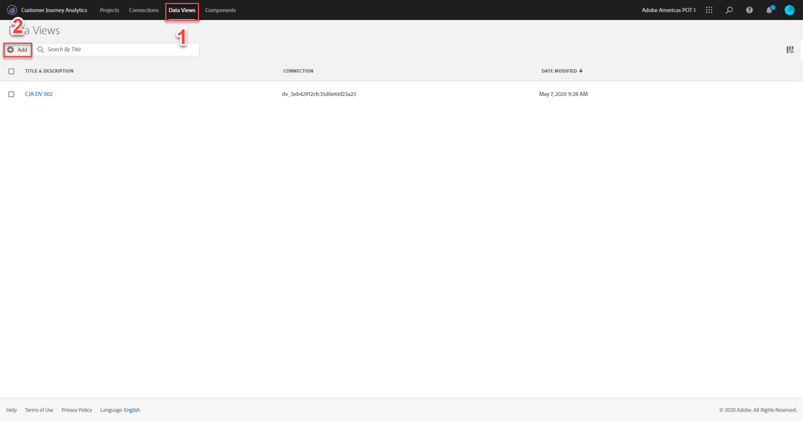
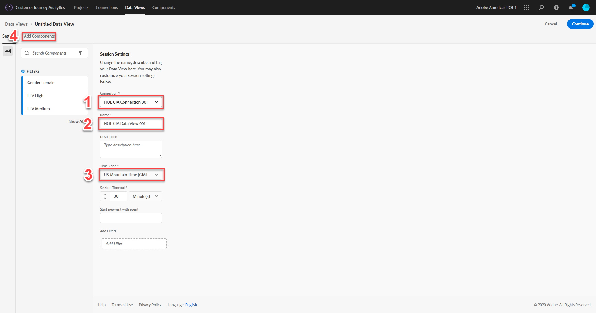
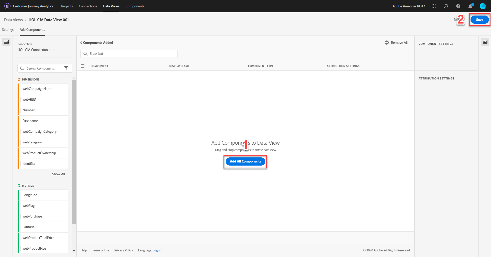

# Introduction to Analysis Workspace

## Objective

Create a dashboard in CJA.

## Lesson Context

Understand how to create a dashboard using web, call center and CRM datasets.

### Exercise 1.1

Log in to CJA

1. Navigate to the Experience Platform [https://experience.adobe.com/](https://experience.adobe.com/).
2. Login with provided credentials.
3. Click on "Customer Journey Analytics" from the Quick access bar, or navigate to [https://analytics.adobe.com/](https://analytics.adobe.com/).

     <kbd></kdb>

### Exercise 1.2

Creating a project
1. Click "Projects" in the top nav.
2. Click "Create New Project".

<kbd></kdb>

### Analysis Workspace User Interface

<kbd></kdb>

The left side rail contains the panel menu (where new panels can be dragged to the project), the visualization menu (where visualizations can be dragged to a panel), and the components menu (where Dimensions, Metrics and Filters are found and can be dragged to the panel visualizations.

Working with Filters
----------------
- Creating a filter
- Creating a cross-channel filter
- Applying filters

Working with Metrics
----------------
- Creating a basic metric
- Creating a cross-channel metric

Working with Attribution IQ
----------------

Cross-Channel Pathing
----------------
- Working with the Flow visualization
- Working with the Fallout visualization
- Working with Cohort Tables
- Working with Sequential Filters

Using the Venn Visualization to measure cross-over
----------------
- Creating a basic metric
- Creating a cross-channel metric

# Customer Journey Analytics

## Table of Contents

* [Lab Overview](#lab-overview)
* [CJA Setup](#CJA-Setup)

## Lab Overview

Today, most businesses collect mountains of data in their quest to better understand their customers so they can create great products and experiences. But the challenge isn’t just collecting more data, it’s integrating, analyzing, understanding, and sharing that data across the business. It requires the right data, from all channels, working together to paint a holistic picture of the customer journey, as well as the right tools to analyze the journey and quickly activate discovered insights. Customer Journey Analytics provides a toolkit to business intelligence and data science teams that help them stitch and analyze cross-channel data. Its capabilities deliver context and clarity to the complex multichannel customer journey.

This lab will show you how to use data ingested into Adobe Experience Platform within Customer Journey Analytics.

### Key Takeaways

* Understand concepts of CJA
* Create Connections and Data Views in CJA
* Analyze data in CJA by creating projects and workspaces

### Prerequisites

* High-level understanding of the Adobe Experience Platform
* Basic knowledge of Adobe Analytics
* Basic knowledge of Analysis Workspace in Adobe Analytics

### Background

Customer Journey Analytics is an Adobe Experience Platform Application Service that lets you use the power of Analysis Workspace with data from Adobe Experience Platform. It can break down, filter, query, and visualize years' worth of data, and is combined with Platform's ability to hold all kinds of data schemas and types. Using the Experience Data Model (XDM), data can be uniformly represented and organized, ready for combination and exploration. Experience Query Services in AEP allows you to use SQL-compatible tools and frameworks to query and manipulate all your data. This data can then be imported into CJA for further analysis.

For today’s lab, we will be using 3 datasets from 3 different data sources:

1. Reduced Web EE Dataset
2. Call Center EE Dataset
3. CRM Data

### Customer Journey Analytics workflow

The schemas and datasets for the data sources have already been set up. These steps were covered in the Foundations session. We will begin this lab with step 3 from above steps.

# CJA Setup

## Objective

1. Create Data Connection
2. Create Data View

## Lesson Context

In this lesson, we will get started with CJA. We will understand how to import the datasets available in AEP into CJA by creating data connections and data views.

### Exercise 1.1

Getting Started in CJA

1. Open CJA and ensure you are connected to the correct org.
 [http://analytics.adobe.com/](http://analytics.adobe.com/)

   You should see the screen as below
   

### Exercise 1.2

Creating a Connection

1. Click on "Connections" tab then click on the "Create new connection" button.
   

2. Check the box next to the "Reduced Web EE Dataset", "Call Center EE Dataset" and "CRM Profile Dataset" dataset then click the "Add" button.
   

3. For each dataset, click on it and verify the correct "Person ID" is set as per the below table. After you've verified each, click the  "Next" button in the upper-right corner.

    | Dataset | Person ID |
    | ------- | --------- |
    | Reduced Web EE Dataset      | CRMIDCombo        |
    | Call Center EE Dataset      | CRMID        |
    | CRM Profile Dataset      | CRMID        |

   
   
   

 Note: If datasets have more than one identity, you need to go through each dataset and select the appropriate ID as "Person ID".

4. Name your connection (HOL CJA Connection *attendee number*). Click the "Save" button instead of the "Save & create a data view" button by clicking the down icon.
   

### Exercise 1.3

Creating a Data View

1. Click "Data Views" in the top navigation then click "+ Add" near the top.
   

2. Select your connection from the "Connection" drop-down. Name your data view (HOL CJA data View *attendee number*). Select your "Time Zone" and click "Add Components".
   
Note: The "Session Timeout" and "Start new visit with event" and filters are configurable as well.

3. You can limit dimensions and metrics in a Data View, but we'll include everything, so click the "Add All Components" button in the middle of the page and click "Save". 
   

You should now be able to see your data view under the "Data View" tab. 

