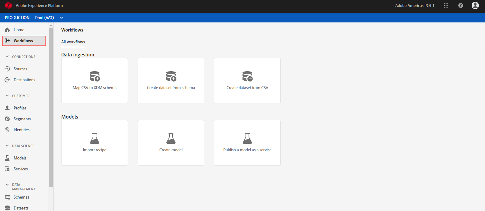
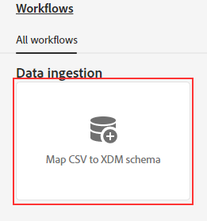
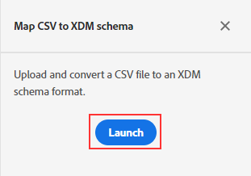
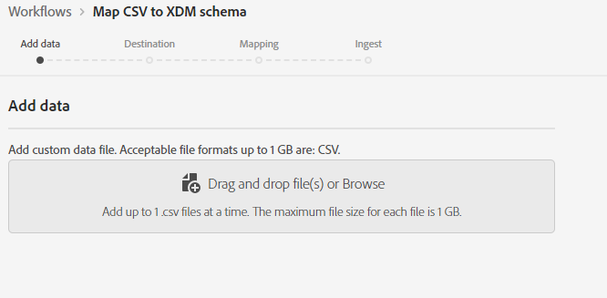
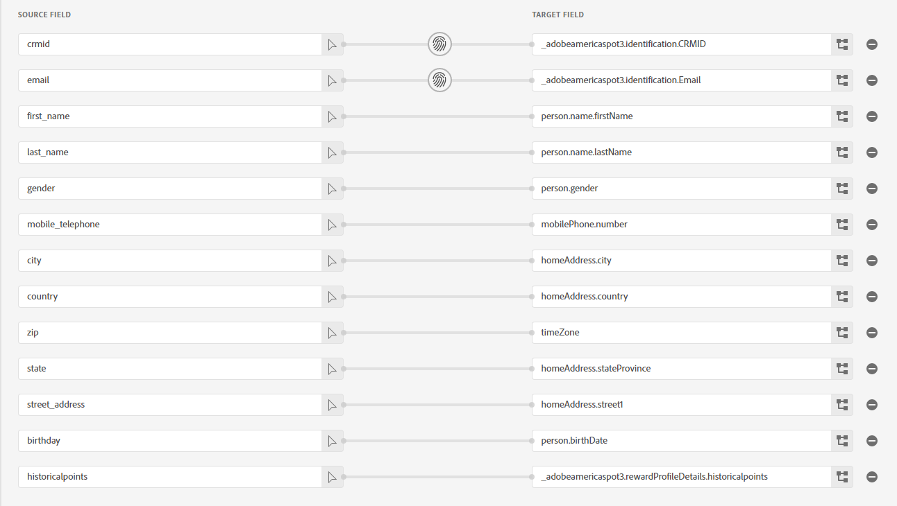
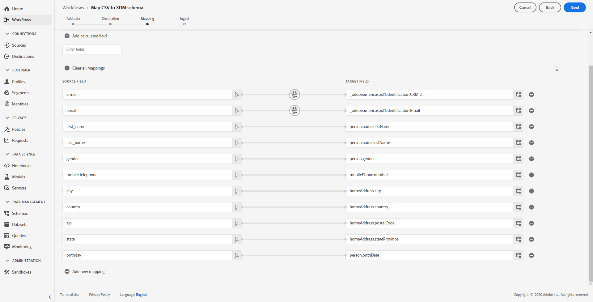
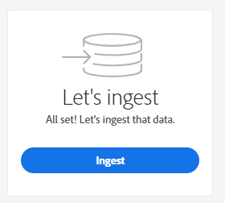
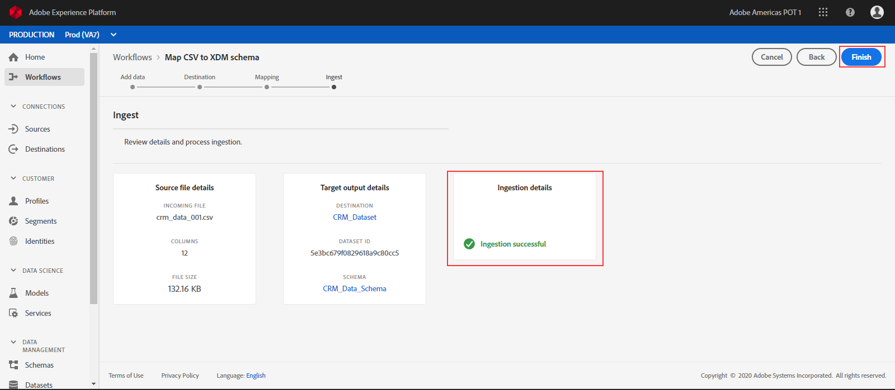

Lab - Ingestion - CSV to XDM Mapping
==========
<table style="border-collapse: collapse; border: none;" class="tab" cellspacing="0" cellpadding="0">

<tr style="border: none;">

<td width="600" style="border: none;">
<table>
<tbody valign="top">
      <tr width="500">
            <td valign="top"><h3>Objective:</h3></td>
            <td valign="top"> This lab will show you how to add CSV data to an exisitng AEP dataset.
            </td>
     </tr>
     <tr width="500">
           <td valign="top"><h3>Prerequisites:</h3></td>
           <td valign="top"> <li>download "crm_data_001.csv" file</li>
                            <li>schema in place</li>
                            <li>dataset in place</li>
           </td>
     </tr>
</tbody>
</table>
</td>

<td style="border: none;" valign="top">

<table>
<tbody valign="top">
      <tr>
            <td valign="middle" height="70"><b>section</b></td>
            <td valign="middle" height="70"></td>
      </tr>
      <tr>
            <td valign="middle" height="70"><b>version</b></td>
            <td valign="middle" height="70">1.0.1</td>
      </tr>
      <tr>
            <td valign="middle" height="70"><b>date</b></td>
            <td valign="middle" height="70">2020-05-11</td>
      </tr>
</tbody>
</table>
</td>

</tr>
</table>

Instructions:
-----------------
Go to https://platform.adobe.com/home

1. In the left-hand menu, navigate to "Workflows".

2. We will be ingesting a CSV file. Please select "Map CSV to XDM schema".

3. Click "Launch" to start the workflow.

4. The first step is to select the Destination, the dataset to which the data will be added. Search for "CRM Profile Dataset", select it and click "Next".

5. The next step is to Add data. Navigate to, or drag and drop the 'crm_data_001.csv' file, from the lab exercise downloads. Within a few seconds, you will see a preview of the data. Click "Next". 

 
6. Next, we need to map the CSV file fields to the XDM fields in the schema. The mapper tried to parse and map fields however, there are some that were not mapped or mapped incorrectly. We will make corrections.

7. To remap a field, click the  icon to open the schema.

Once corrected, the mappings should match the screenshot below. Once you have verified the mappings are correct, click "Next".

8. Finally, we are ready to ingest the data. Click "Ingest".

9. Adobe Experience Platform will start the workflow of converting the CSV file data to XDM format. This process takes a few minutes. Once completed, click "Finish" to complete the workflow.

10. Congratulations! You have imported a CSV file into Adobe Experience Platform.

 
 
 

Return to [Lab Agenda Directory](https://github.com/adobe/AEP-Hands-on-Labs/blob/master/labs/fsi6/README.md#lab-agenda)