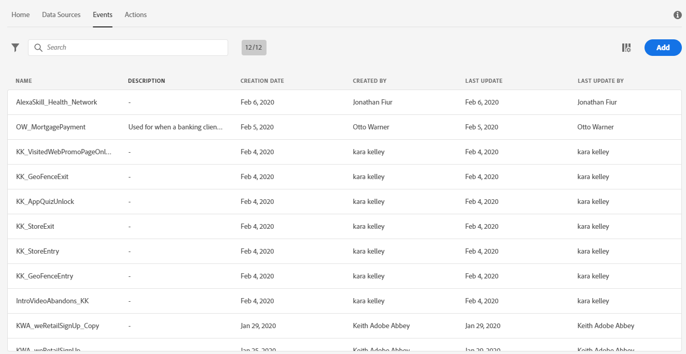
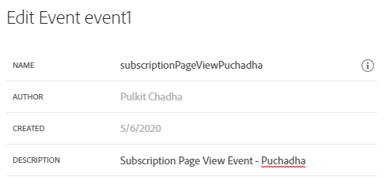
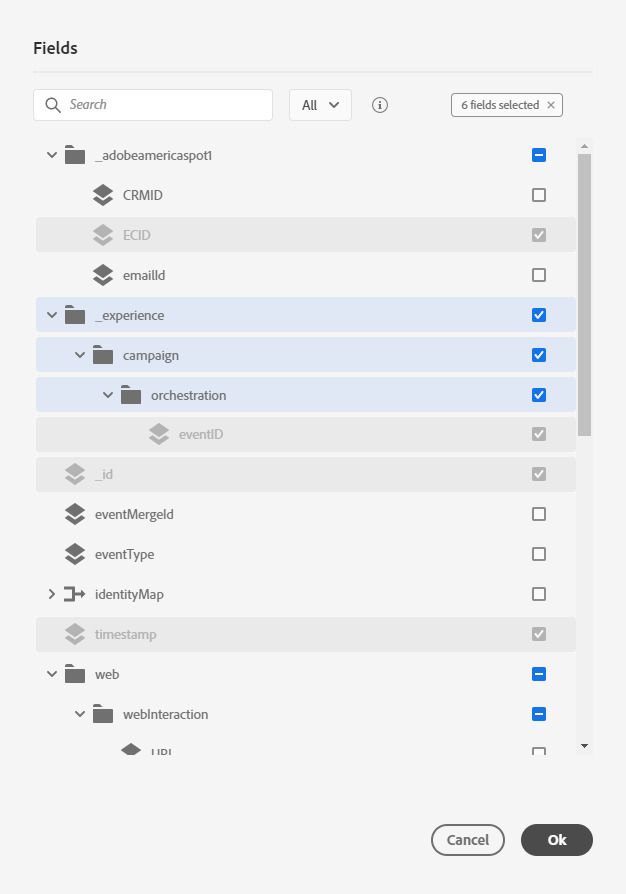
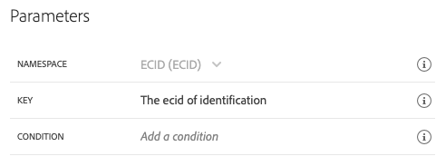

## Exercise 1 - Define an Event

In this exercise, you'll create a custom Event by making use of Journey Orchestration in combination with Adobe Experience Platform.

1. Go to [https://experience.adobe.com/#/@adobeamericaspot5/home](https://experience.adobe.com/#/@adobeamericaspot5/home)

   You'll see the `Adobe Experience Cloud`-homepage.

    

2. Click on `Journey Orchestration`.

    

    Next, you'll see the `Journey Orchestration`-homepage.

    

3. In the menu, click on `Events`.

    

    You'll then see the `Events`-list.

    

4. Click `Add` to start adding your event.

    

    You'll see an empty event popup.

    <!---
    
    --->

    <kbd></kdb>

5. Name the Event **subscriptionPageView{emailAddress}** and replace **{emailAddress}** with your email address name. E.g. **subscriptionPageViewPuchadha**.

   Set Description to: **Subscription Page View Event - {your email name}**

   <!---
   
   --->

    <kbd></kdb>

6. Next, you need to select a Schema. All Schemas that are shown here, are Adobe Experience Platform Schemas.

   <!---
   
   --->

   <kbd></kdb>

    To show up in this list, a Schema needs to have a very specific Mixin linked to it. The Mixin that is needed to show up here is called `Orchestration eventID`.

    In our use case, we want to listen for a Sign up Event. This event is part of the `Website interactions EE v.1` schema. Select this from the list.

    <!---
    
    --->

    <kbd></kdb>

7. Journey Orchestration will then automatically select some required fields, but you can edit the fields that are made available to Journey Orchestration.

    

8. Click the `pencil`-icon to edit the fields.
   You'll then see a popup-window with a Schema Hierarchy that allows you to select fields.

    

    Fields such as the ECID and the Orchestration eventID are required, and as such, preselected.
    However, a marketeer needs to have flexible access to all data points that provide context to a Journey. So you can select additional fields.
    Once you are finished reviewing the fields, select `OK`.

    

9.Journey Orchestration also needs an Identifier to identify the customer. Since Journey Orchestration is linked to Adobe Experience Platform, all Identity Namespace will be displayed. We will be selecting ECID.

    <kbd></kdb>

    The Identifier will also automatically use the full Identity Graph of the Adobe Experience Platform and link all behavior across all available identities, devices and channels to the same profile. The result is that Journey Orchestration is contextual, relevant and consistent.

    <!---
    
    --->

    <kbd></kdb>

10. Click `Save` to save your custom event.

    

10. Finally, you need to recover the `Orchestration eventID` for your custom event.

    Open your event again by clicking it in the list of events.

    On your Event, click on the `View Payload`-icon next to `Fields`.

    

11. Clicking the `View Payload`-icon opens up a sample XDM payload for this event.

    

    Scroll down in the `Payload` until you see the line `eventID`.

    

12. Note down the `eventID` as you'll need it in the last exercise to test your configuration.

    In this example, the `eventID` is `e133bb4d5075fe9e0356b2136d6413c723d05d146831c6d165d70a5a0dc4a6b8`.

    You've now defined the event that will trigger the Journey we're building. Once the Journey is triggered, the geofence-fields like City, Country, Name, Latitude and Longitude will be made available to the Journey.

    As discussed in the use-case description, we then need to provide contextual promotions that depend on the weather. In order to get weather information, we'll need to define an external data sources that will provide us with the weather information for that location. We'll use the `OpenWeather`-service to provide us what that information, as part of exercise 2.

---

Next Step: [Exercise 2 - Define an External Data Source](./Exercise2-DataSources.md)
