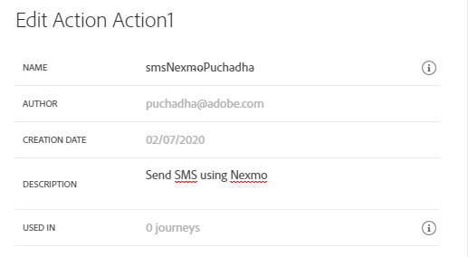
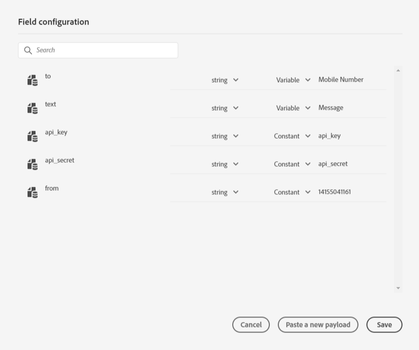
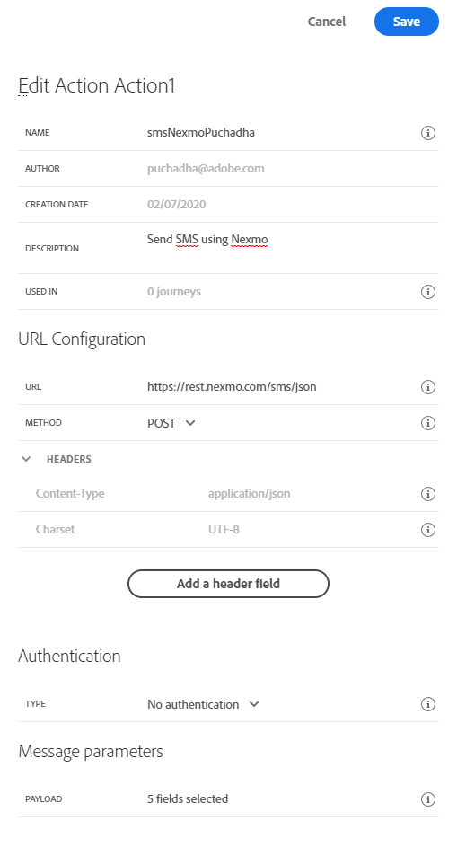

## Exercise 3 - Define Custom Actions

In this exercise, you'll create 2 custom Actions by making use of Journey Orchestration in combination with Adobe Experience Platform

1. Go to [https://experience.adobe.com/#/@adobeamericaspot5/home](https://experience.adobe.com/#/@adobeamericaspot5/home)

   You'll see the `Adobe Experience Cloud`-homepage.

   

2. Click on `Journey Orchestration`.

   

   Next, you'll see the `Journey Orchestration`-homepage.

   

3. In the menu, click on `Actions`.

   

   You'll then see the `Actions`-list.

   <!---
   
   --->

   <kbd></kdb>

4. We will define an actions that sends an SMS using an external application, Nexmo

   ### Action: Send SMS using Nexmo

   Nexmo is a 3rd party provider of SMS Messages. It has an easy-to-use API and we'll use Journey Orchestration to trigger their API.

5. Click `Add` to start adding your action.

   

   You'll see an empty Action popup.

   <!---
   
   --->

   <kbd></kdb>

6. Name the Action, use **smsNexmo{emailAddress}** and replace **{emailAddress}** with your your email name. E.g. **smsNexmoPuchadha**.

   Add the Description: **Send SMS using Nexmo**.

   <!---
   
   --->

   <kbd></kdb>

7. For the `URL Configuration`, copy and paste this URL:

   - URL: `https://rest.nexmo.com/sms/json`
   - Method: `POST`

   Do not change the Header Fields.

   <!---
   
   --->

   <kbd></kdb>

8. `Authentication` should be set to `No Authentication`.

   <!---
   
   --->

   <kbd></kdb>

9. So for the `Message Parameters`, click the `Edit Payload`-icon.

   <!---
   
   --->

   <kbd></kdb>

   You'll then see an empty popup-window.

   

   Copy and paste the JSON below into the popup-window.

   ```json
   {
     "to": {
       "toBeMapped": true,
       "dataType": "string",
       "label": "Mobile Number"
     },
     "text": {
       "toBeMapped": true,
       "dataType": "string",
       "label": "Message"
     },
     "api_key": "api_key",
     "api_secret": "api_secret",
     "from": "14155041161"
   }
   ```

   The api_key and api_secret values will be provided seperately

   

10. Click `Save`.

    

    Scroll up and click `Save` one more time to save your custom Action.

    <!---
    
    --->

    <kbd></kdb>

    Your custom Action is now part of the `Actions`-list.

    

    Let's define your second action now.

You've now defined Events, Data Sources and Actions - let's consolidate all of that in one Orchestrated Journey.

---

Next Step: [Exercise 4 - Design a trigger-based Customer Journey](./Exercise4-Journey.md)
