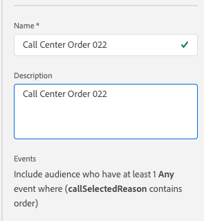
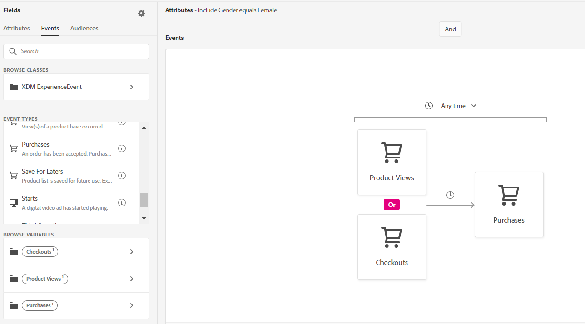
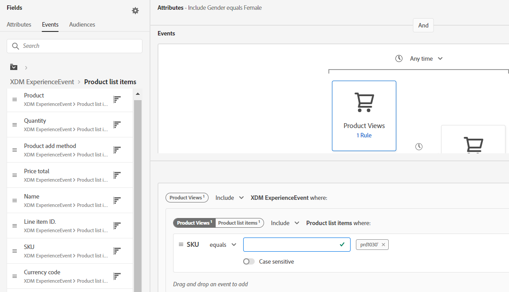
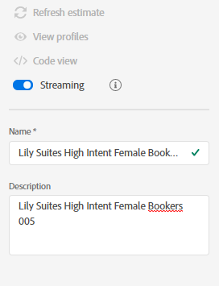
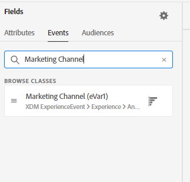
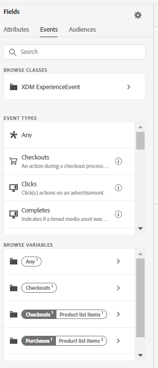

Lab 1 - ExperienceEvent Segmentation
==========
<table style="border-collapse: collapse; border: none;" class="tab" cellspacing="0" cellpadding="0">

<tr style="border: none;">

<td width="600" style="border: none;">
<table>
<tbody valign="top">
      <tr width="500">
            <td valign="top"><h3>Objective:</h3></td>
            <td valign="top"> In this exercise, we’ll create a basic segment using a single field in Call Center ExperienceEvent. 
       On an ongoing basis, a retailer wants to create a basic segment for customers who place an order with a Call Center representative. This segment will be added to other segments for other marketing events. 
            </td>
     </tr>
     <tr width="500">
           <td valign="top"><h3>Prerequisites:</h3></td>
           <td valign="top"> none</td>
     </tr>
</tbody>
</table>
</td>

<td style="border: none;" valign="top">

<table>
<tbody valign="top">
      <tr>
            <td valign="middle" height="70"><b>section</b></td>
            <td valign="middle" height="70"></td>
      </tr>
      <tr>
            <td valign="middle" height="70"><b>version</b></td>
            <td valign="middle" height="70">1.0.1</td>
      </tr>
      <tr>
            <td valign="middle" height="70"><b>date</b></td>
            <td valign="middle" height="70">2020-01-06</td>
      </tr>
</tbody>
</table>
</td>

</tr>
</table>

Instructions:
-----------------
1.	Navigate to Segment Builder in the left navigation

      <kbd></kbd>

2.    Click "Create segment" on the top right.

      <kbd></kbd>

3.	Click the gear icon to the right of Fields in the left pane

      <kbd></kbd>

4.	Verify ‘Show full XDM schema’ is selected, and if not, select it
      <!--
      
      -->
      
      <kbd></kbd>
      
5.	Click on the gear icon again to hide the setting

      <kbd></kbd>

6.	Select ‘Events’ under Fields

      <kbd></kbd>

7.	Click on ‘XDM ExperienceEvent’ under Browse Classes

      <kbd></kbd>
      
8.	Click on ‘Adobeamericaspot 5’ to expand the objects below that namespace
      
      <kbd></kbd>

9.	Click on ‘callcenterDetails’
   
      <kbd></kbd>      

10.	Drag the ‘callSelectedReason’ field over to the Segment canvas
      <!--
      
      -->
      
      <kbd></kbd>    
      
11.	Change the operator to "contains".
	In the text box to the right of "contains", type “order” and press ‘Enter’
      <!--
      
      -->
      
      <kbd></kbd>  

12.	Enter the segment name “Call Center Order” followed by your Student ID (e.g. “Call Center Order 025”)
	 Enter the same value as the description
      
      <kbd></kbd>       
           
13.	Save the Segment
      <!--
      
      -->
      
      <kbd></kbd>  
      
NOTE: Estimate link may not show results if qualified profiles are statistically small and not recognized across dataset scans 
 
 
 

Lab 2 - Attribute + Sequential ExperienceEvents Segmentation
==========
<table style="border-collapse: collapse; border: none;" class="tab" cellspacing="0" cellpadding="0">

<tr style="border: none;">

<td width="600" style="border: none;">
<table>
<tbody valign="top">
      <tr width="500">
            <td valign="top"><h3>Objective:</h3></td>
            <td valign="top"> In this exercise, we’ll create a segment using both a Profile Attribute and ExperienceEvents using a Sequential Segment that compares multiple event conditions 
       A retailer wants to email a promotional discount offer to existing female customers who have viewed or begun an online order for their premier product but have not ordered the item after either online event in the last 24 hours. </td>
     </tr>
     <tr width="500">
           <td valign="top"><h3>Prerequisites:</h3></td>
           <td valign="top"> none</td>
     </tr>
</tbody>
</table>
</td>

<td style="border: none;" valign="top">

<table>
<tbody valign="top">
      <tr>
            <td valign="middle" height="70"><b>section</b></td>
            <td valign="middle" height="70"></td>
      </tr>
      <tr>
            <td valign="middle" height="70"><b>version</b></td>
            <td valign="middle" height="70">1.0.1</td>
      </tr>
      <tr>
            <td valign="middle" height="70"><b>date</b></td>
            <td valign="middle" height="70">2020-01-06</td>
      </tr>
</tbody>
</table>
</td>

</tr>
</table>

Instructions:
-----------------
1.	Navigate to Segment Builder in the left navigation

      <kbd></kbd>

2.    Click "Create segment" on the top right.

      <kbd></kbd>
      
      
3.	Click the gear icon to the right of Fields in the left pane

      <kbd></kbd>

4.	Verify ‘Show full XDM schema’ is selected and if not, select it

      <kbd></kbd>

5.	Click on the gear icon again to hide the setting
    
      <kbd></kbd>

6.	Select ‘Attributes’ under Fields

	<kbd></kbd>

7.	Click on the ‘XDM Individual Profile’ object under Browse Attributes

	<kbd></kbd>

8.	Click on ‘Person’ 

	<kbd></kbd>

9.	Drag the ‘Gender’ field to the Segment canvas

	<kbd></kbd>

10.	Start entering ‘Female’ in the text box and when the value displays, select it and press Enter. The ‘Gender’ field is an enum field to limit the values stored in that field.
      <!--
      
      -->
     
     <kbd></kbd>
      
11.	Next, select ‘Events’ under Fields in the left pane

	<kbd></kbd>

12.	Under ‘Event Types’ locate the ‘Product Views’ event and drag that to the segment canvas below the Profile attribute just added

	<kbd></kbd>

13.	Under ‘Events’ in the left pane, locate ‘Checkouts’ and drag that to the segment canvas below the ‘Product Views’ event so that they are vertically stacked.

	<kbd></kbd>

14.	Update the operator to ‘Or’ between ‘Product Views’ and ‘Checkouts’
      <!--
      
      -->
      <kbd></kbd>
      
15.	Under ‘Events in the left pane, locate ‘Purchases’ and drag that to the segment canvas to the right of the ‘Product Views’ and ‘Checkouts’ events
      <!--
      
      -->
            
       <kbd></kbd>
            
16.	Click on ‘Product Views’ in the segment canvas. A container will appear below to Include a XDM ExperienceEvent

	<kbd></kbd>

17.	In the left pane, click on ‘XDM ExperienceEvent’ and then click on ‘Product List Items’ in the resulting display

	<kbd></kbd>

18.	Select the 'SKU' field and drag it into the ‘XDM ExperienceEvent’ container for ‘Product Views’

	<kbd></kbd>

19.	Enter ‘prd1030’ in the text box to the right of 'SKU equals' and press ‘Enter’
      <!--
      
      -->
      
	<kbd></kbd>

20.	Click on ‘Checkouts’ in the segment canvas. A container will appear below to Include a XDM ExperienceEvent

	<kbd></kbd>

20.	In the left pane, click on ‘XDM ExperienceEvent’ and then Click ‘Product List Items’ in the resulting display

	<kbd></kbd>

21.	Select the 'SKU' field and drag it into the ‘XDM ExperienceEvent’ container for ‘Checkouts’

	<kbd></kbd>

22.	Enter ‘prd1030’ in the text box to the right of 'SKU equals' and press ‘Enter’

	<kbd></kbd>

23.	Click on ‘Purchases’ in the segment canvas. A container will appear below to Include a XDM ExperienceEvent

	<kbd></kbd>

23.	In the left pane, click on ‘XDM ExperienceEvent’ and then Click ‘Product List Items’ in the resulting display

	<kbd></kbd>

24.	Select the 'SKU' field and drag it into the ‘XDM ExperienceEvent’ container for ‘Purchases’

	<kbd></kbd>

25.	Enter ‘prd1030’ in the text box to the right of 'SKU equals' and press ‘Enter’

	<kbd></kbd>

26.	Change the container operator to ‘Exclude’ for ‘Purchases’
      <!--
      
      -->
      
      <kbd></kbd>
            
27.	At the top of the ‘Events’ canvas, update the time value to ‘In last 24 Hour(s)’
	
	<kbd></kbd>
     
	
28.	Enter the segment name “Premier Product High Intent Female Purchasers” followed by your Student ID (e.g. “Premier Product High Intent Female Purchasers 005”).  Enter the same value as the description

	<kbd></kbd>

29.  	Confirm your final segment is consistent with the screenshot.

	<kbd></kbd>      

30.	Save the Segment
      <!--
      
      -->
      
      <kbd></kbd>       
      
 
 
 
 

Lab 3 - Dynamic Segmentation
==========
<table style="border-collapse: collapse; border: none;" class="tab" cellspacing="0" cellpadding="0">

<tr style="border: none;">

<td width="600" style="border: none;">
<table>
<tbody valign="top">
      <tr width="500">
            <td valign="top"><h3>Objective:</h3></td>
            <td valign="top"> In this exercise, we’ll create a segment using Commerce ExperienceEvents and dynamic segmentation. Dynamic segmentation solves the scalability problems marketers traditionally face when building segments for marketing campaigns or other use cases where setting up multiple variations of the same segment was required. 
        </td>
     </tr>
     <tr width="500">
           <td valign="top"><h3>Prerequisites:</h3></td>
           <td valign="top"> none</td>
     </tr>
</tbody>
</table>
</td>

<td style="border: none;" valign="top">

<table>
<tbody valign="top">
      <tr>
            <td valign="middle" height="70"><b>section</b></td>
            <td valign="middle" height="70"></td>
      </tr>
      <tr>
            <td valign="middle" height="70"><b>version</b></td>
            <td valign="middle" height="70">1.0.1</td>
      </tr>
      <tr>
            <td valign="middle" height="70"><b>date</b></td>
            <td valign="middle" height="70">2020-01-06</td>
      </tr>
</tbody>
</table>
</td>

</tr>
</table>

Instructions:
-----------------
1.	Navigate to Segment Builder in the left navigation

      <kbd></kbd>

2.    Click "Create segment" on the top right.

      <kbd></kbd>

3.	Click the gear icon to the right of Fields in the left pane

      <kbd></kbd>

4.	Verify ‘Show full XDM schema’ is selected, and if not, select it
      <!--
      
      -->
      
      <kbd></kbd>
      
5.	Click on the gear icon again to hide the setting

      <kbd></kbd>

6.	Select ‘Events’ under Fields

      <kbd></kbd>
      
7.	In the search box, enter ‘evar1’
      <!--
      
      -->
      
      <kbd></kbd>      
            
8.	Under ‘Browse Classes’, find and drag ‘eVar1’ to the segment canvas.  (Be sure it follows this path:  XDM 		ExperienceEvent > Experience > Analytics > Custom Dimensions > eVars > eVar1) It is usually the second entry listed.

	<kbd></kbd>
	
9.	Type ‘email’ in the text box to the right of ‘eVar1 equals' and press Enter
      <!--
      
      -->
      
      <kbd></kbd>      

10.	In the left pane, clear out the Search box

	<kbd></kbd> 

11.	Under ‘Event Types’, locate ‘Checkouts, and drag this to the segment canvas to the right of the ‘Any’ event

	<kbd></kbd> 
     
12.	Click on ‘Checkouts' in the Events canvas

	<kbd></kbd>       

13.	In the left pane, click on ‘XDM ExperienceEvent’ and ‘Product list items’ in the resulting display

	<kbd></kbd>

14.	Select the ‘SKU’ field and drag that into the ‘XDM ExperienceEvent’ container for ‘Checkouts’

	<kbd></kbd>

15.	Change the operator to “exists”     
      <!--
      
      -->
      <kbd></kbd>          

16.	In the left pane, locate ‘Purchases’ and drag this to the segment canvas to the right of the ‘Checkouts’ event.

	<kbd></kbd>
	
17.	Click on ‘Purchases' in the Events canvas	

	<kbd></kbd>

18.	In the left pane, click on ‘XDM ExperienceEvent’ and ‘Product list items’ in the resulting display

	<kbd></kbd>

19.	Select the ‘SKU’ field and drag that into the ‘XDM ExperienceEvent’ container for ‘Purchases’

	<kbd></kbd>

21.	In the left pane, click on the Events link. 
      <!--
      
      -->
      <kbd></kbd>  
      
      You should see ‘Browse Classes’, ‘Event Types’ and ‘Browse Variables’ sections appear
      
      <kbd></kbd>  
      
21.	Click on ‘Checkouts1 | Product list items1’

	<kbd></kbd>  

22.	Select the 'SKU' field and drag this to the right of ‘SKU equals’ in the ‘XDM Event Container’ for the Purchases event. Release once the dynamic variable is positioned over the second box displays and drop. 

	<kbd></kbd>  

The resulting statement should be ‘SKU equals Checkouts1 | Product list items1 SKU XDM ExperienceEvent > Product list items > SKU’

   <kbd></kbd> 

22.	Change the ‘XDM ExperienceEvent’ container for ‘Purchases1’ to ‘Exclude’
      <!--
      
      -->

      <kbd></kbd>  
      
23.	At the top of the ‘Events’ canvas, update the time value to ‘In last 24 Hour(s)’

	<kbd></kbd>
      
24.	Ensure ‘Streaming’ is enabled in the right pane

	<kbd></kbd>

25.	Enter the segment name “Email Channel Online Order Abandoners” followed by your Student ID (e.g. “Email Channel Online Order Abandoners 025”).  Enter the same value as the description

	<kbd></kbd>

26.	Confirm your final segment is consistent with the screenshot.  

	<kbd></kbd>

27.	Save the Segment

	<kbd></kbd>   

 
 
 

Return to [Lab Agenda Directory](https://github.com/adobe/AEP-Hands-on-Labs/blob/master/labs/retail/README.md#lab-agenda)
 
 
