# Lab - Build a Bookings schema (ExperienceEvent)

<table style="border-collapse: collapse; border: none;" class="tab" cellspacing="0" cellpadding="0">

<tr style="border: none;">

<td width="600" style="border: none;">
<table>
<tbody valign="top">
      <tr width="500">
            <td valign="top"><h3>Objective:</h3></td>
            <td valign="top"> This lab will show you how to construct a schema
            </td>
     </tr>
     <tr width="500">
           <td valign="top"><h3>Prerequisites:</h3></td>
           <td valign="top"> none
           </td>
     </tr>
</tbody>
</table>
</td>

<td style="border: none;" valign="top">

<table>
<tbody valign="top">
      <tr>
            <td valign="middle" height="70"><b>section</b></td>
            <td valign="middle" height="70"></td>
      </tr>
      <tr>
            <td valign="middle" height="70"><b>version</b></td>
            <td valign="middle" height="70">1.0.10</td>
      </tr>
      <tr>
            <td valign="middle" height="70"><b>date</b></td>
            <td valign="middle" height="70">2020-01-06</td>
      </tr>
</tbody>
</table>
</td>

</tr>
</table>

Before we begin go to [https://platform.adobe.com/home](https://platform.adobe.com/home). Follow the instructions detailed below.

## Instructions:

1. In the left-hand menu, navigate to "Schemas".

      

2. Click "Create Schema" on the top right. Select "XDM ExperienceEvent".

      

3. Click on "Untitled Schema" in the structure view

    <!---
    
    --->

    <kbd></kdb>

4. In the right-hand Schema properties menu, name it "Bookings EE Schema &lt;your-assigned-number>".
   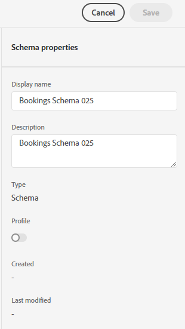

5. In the left-hand Composition menu, click on the "+Add" button across from "Mixins".

    <!---
    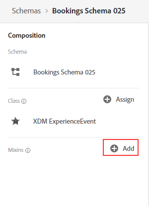
    --->

    <kbd></kdb>

6. We will be adding two pre-built mixins listed below:

    - Booking Details Mixin EE
    - Identities Mixin EE

    Search for 'Booking Details Mixin EE'. Select the mixin and click "Add mixin".

    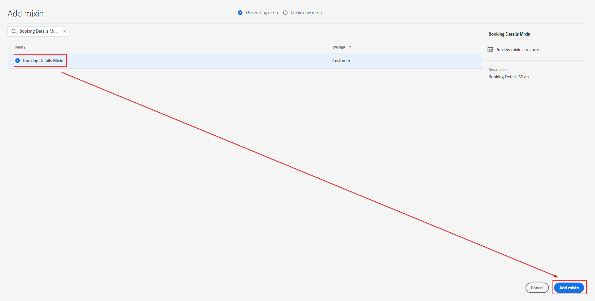

    Your schema will now have the bookingDetails object and all of the fields within this object

      <!---
      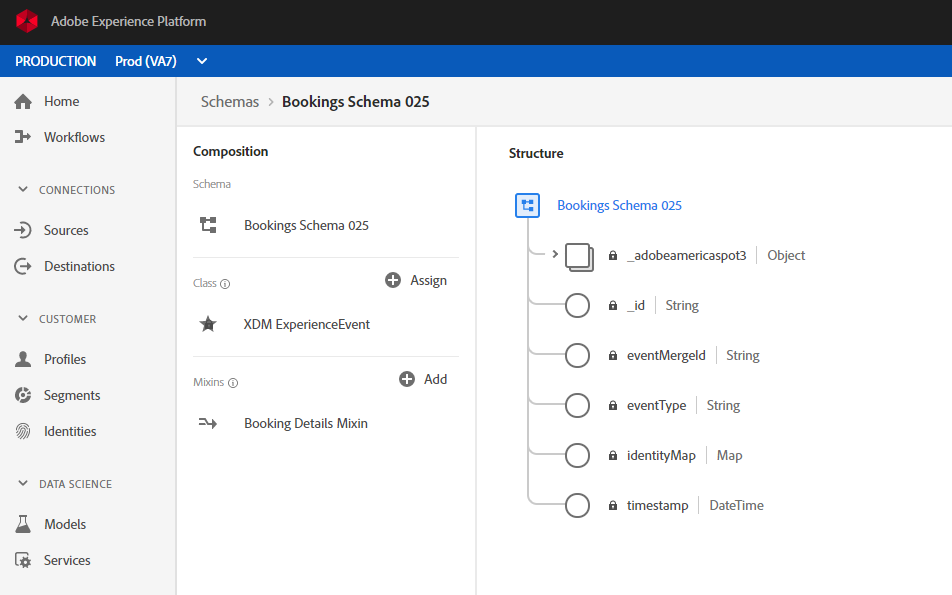
      --->

    <kbd></kdb>

    Click "+Add" to go back to the Mixin list.
    <!---
    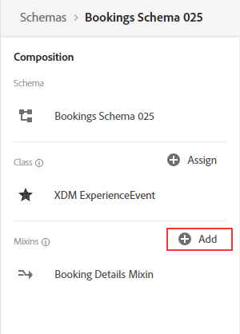
    --->

    <kbd></kdb>

    Search for 'Identities Mixin EE'. Select the mixin and click "Add mixin".

    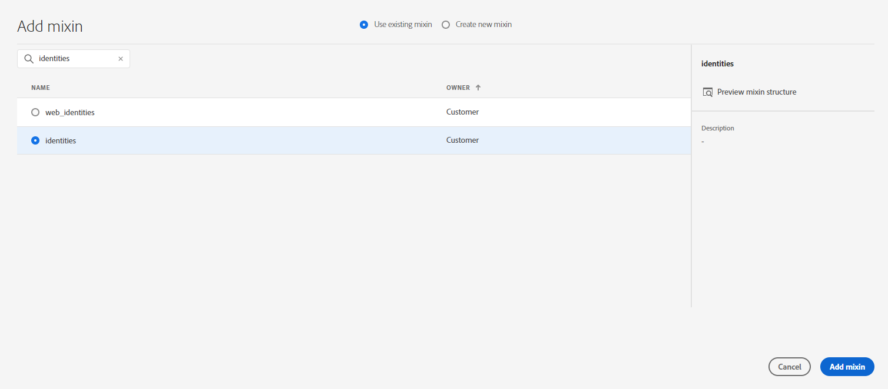

7. We'll also create a new Mixin from scratch. Click the "+Add" button on the left panel.

      <!---
      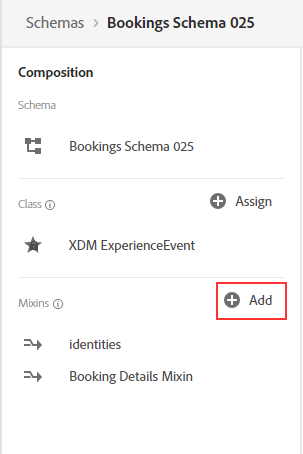
      --->

    <kbd></kdb>

8. Select "Create new mixin" at the top.

      

9. Name it "Order Details Mixin &lt;your-assigned-number>" and then click 'Add Mixin'.

    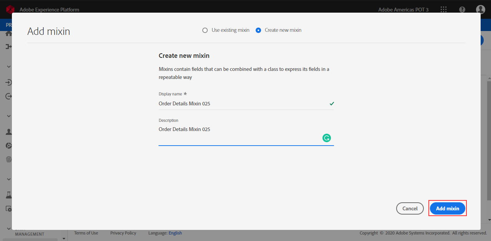
10. In the left-hand Composition menu, click on your newly create mixin (it should be highlighted now).

    <!---
    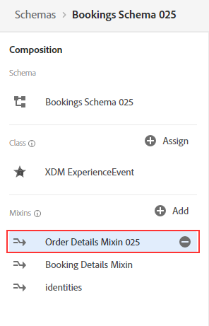
    --->

    <kbd></kdb>

11. Notice that on the Structure view a '+Add Field' appears next to the Schema name, click it to start adding fields.

    <!---
    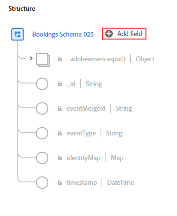
    --->

    <kbd></kdb>

16. On the Field properties panel to the right, add the following:
      | FieldName | orderDetails   |
      | Description | Order Details |
      | Type | Object |

    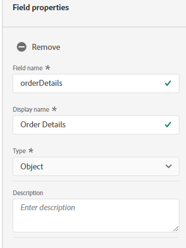

    Scroll  down and hit Apply

    

17. Next, we will be adding fields to the 'orderDetails' object Click "+Add Field" next to this object

    <!---
    
    --->

    <kbd></kdb>

18) On the Field Properties panel to the right add the following  
     FieldName = orderID
    Description = Order ID
    Type = String

     

     Scroll down and hit Apply

    

19. We will be adding one more field to the 'orderDetails' object Click "+Add Field" next to this object

    <!---
    
    --->

    <kbd></kdb>

20) On the Field Properties panel to the right add the following  
     FieldName = orderReservationID
     Description = Order Reservation ID
     Type = String

    Scroll down and hit Apply

    

21. We will be adding one more field to the 'orderDetails' object Click "+Add Field" next to this object

    <!---
    
    --->

    <kbd></kdb>

22) On the Field Properties panel to the right add the following  
     FieldName = orderType
    Description = Order Type
    Type = String

    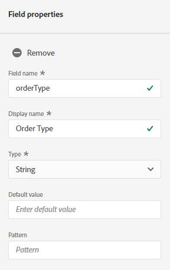

    Scroll down and hit Apply

    

23. We are done with modeling the schema. To Save your work hit Save on the top right corner. Make sure that your schema structure looks like the one in the screenshot below

     <!---
     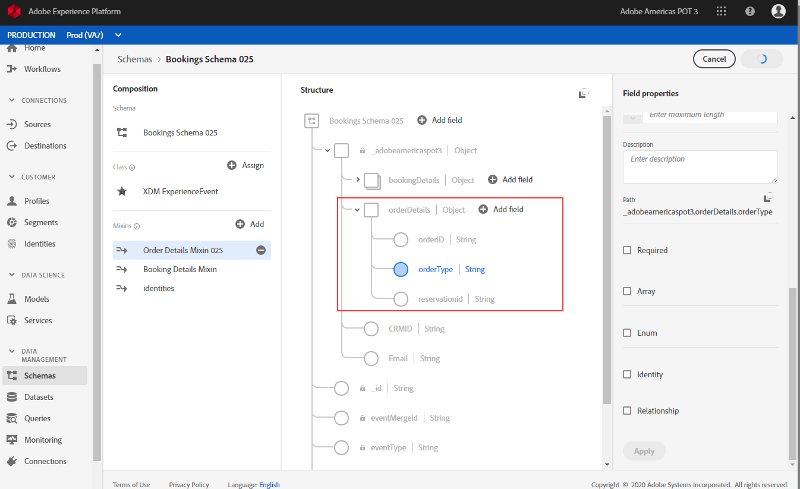
     --->
     <kbd></kdb>

24. Congratulations!!! you have constructed your schema.

 
 
 

Return to [Lab Agenda Directory](https://github.com/adobe/AEP-Hands-on-Labs/blob/master/labs/travel/README.md#lab-agenda)
